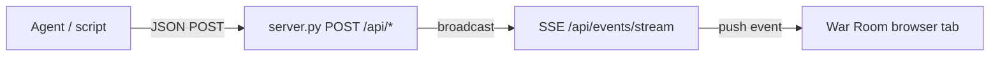

# Agent guide — OPSD War Room

This document is for **automated agents** (Cursor cloud agents, orchestrators, demo scripts) that need to push information into the War Room UI or brief human operators.

## Before you push

1. **Start the server** (static files + API — not plain `http.server`):

   ```bash
   python3 server.py 8765
   ```

2. **Open the UI** in a browser: [http://127.0.0.1:8765/](http://127.0.0.1:8765/)

3. The page **auto-subscribes** to `GET /api/events/stream` (SSE). Any `POST` you send is delivered to open browser tabs within a second.

4. **Do not** use `file://` — fixtures and SSE will not work.

**Base URL:** `http://127.0.0.1:8765`

---

## How delivery works



Each successful POST returns:

```json
{ "ok": true, "id": "<uuid>" }
```

Errors: `400` with `{"error": "..."}` for invalid JSON or unknown `target`.

---

## Endpoints

| Method | Path | Purpose |
|--------|------|---------|
| `GET` | `/api/health` | Liveness check |
| `GET` | `/api/events/stream` | SSE stream (UI only; agents usually POST) |
| `POST` | `/api/slack` | Message to `#opsd-war-room` |
| `POST` | `/api/desk` | Proposal desk update |
| `POST` | `/api/briefing` | AI situation briefing panel |
| `POST` | `/api/events` | Unified router (`target` + `data`) |

### Health check

```bash
curl -s http://127.0.0.1:8765/api/health
```

```json
{ "ok": true, "service": "opsd-war-room" }
```

---

## POST `/api/slack`

Appends a message to the mock Slack feed (`#opsd-war-room`).

**Body** (all fields except `text` are optional):

| Field | Type | Default | Description |
|-------|------|---------|-------------|
| `author` | string | `"API"` | Display name |
| `role` | string | `"EXTERNAL"` | Small-caps role line |
| `time` | string | current UTC `HH:MM` | Timestamp label |
| `text` | string | required | Message body |

```bash
curl -s -X POST http://127.0.0.1:8765/api/slack \
  -H 'Content-Type: application/json' \
  -d '{
    "author": "Tower",
    "role": "CoS / EVENT",
    "time": "14:02",
    "text": "FRA WX band confirmed 14:00–18:00Z. Agents analyzing slice."
  }'
```

---

## POST `/api/desk`

Updates the **Proposal desk** (bottom left). Fields are optional; omitted fields are left as-is.

| Field | Type | Description |
|-------|------|-------------|
| `showContent` | boolean | `false` keeps empty state; default shows desk content |
| `stamp` | string | Stamp label (e.g. `STORM PROPOSAL`) |
| `stampClass` | string | CSS class: `active`, `revised`, `blocked` (no class if omitted) |
| `kpis` | object | `{ "impacted", "cancelSet", "pax" }` |
| `crewBroken` | number | Crew pairing break count (for KPI crew line) |
| `crew` | string | HTML crew line (overrides auto crew text if set) |
| `cancels` | array | Cancel rows: `{ flight, route, pnr, pax }` |
| `recovered` | array | Flight strings to mark RECOVERED in table |
| `delay` | object | Delay row: `{ flight, action, newDep, tail, note }` |
| `grok` | string | Grok recap text in desk panel |
| `note` | string | Appends to API event feed on desk |
| `title` | string | Title for `note` / `html` feed item |
| `html` | string | Raw HTML appended to desk API feed (use carefully) |

**Light touch** — append a note only:

```bash
curl -s -X POST http://127.0.0.1:8765/api/desk \
  -H 'Content-Type: application/json' \
  -d '{
    "note": "Agent queued reprotect options for 8 cancels.",
    "title": "PAX AGENT"
  }'
```

**Full storm-aligned desk** (fixture KPIs 27 / 8 / 574):

```bash
curl -s -X POST http://127.0.0.1:8765/api/desk \
  -H 'Content-Type: application/json' \
  -d '{
    "stamp": "STORM PROPOSAL",
    "stampClass": "active",
    "kpis": { "impacted": 27, "cancelSet": 8, "pax": 574 },
    "crewBroken": 6,
    "crew": "Crew: <strong>6</strong> pairings break FDP · FRA-C-441 on LH041 at 11:40 duty",
    "cancels": [
      { "flight": "LH400", "route": "FRA→JFK", "pnr": "DEMO-4001", "pax": 89 },
      { "flight": "LH1230", "route": "FRA→MUC", "pnr": "DEMO-1230", "pax": 72 }
    ],
    "grok": "Stub recap from agent."
  }'
```

---

## POST `/api/briefing`

Updates the **AI-Assisted Situation Briefing** panel (between OCC Gantt and Proposal desk). This is the best place for operator **catch-up** text.

| Field | Type | Description |
|-------|------|-------------|
| `phase` | string | Merge base from fixture: `idle`, `storm`, `revised`, `blocked` |
| `status` | string | Status chip text (e.g. `ACTIVE DISRUPTION`) |
| `statusClass` | string | `monitoring`, `active`, `revised`, `blocked` |
| `headline` | string | One-line summary |
| `bullets` | array of strings | Scannable facts |
| `actions` | string | Operator focus line |
| `updated` | string | e.g. `14:05Z` |

```bash
curl -s -X POST http://127.0.0.1:8765/api/briefing \
  -H 'Content-Type: application/json' \
  -d '{
    "phase": "storm",
    "status": "ACTIVE DISRUPTION",
    "statusClass": "active",
    "headline": "FRA thunderstorm 14:00–18:00Z — 27 flights in the FRA window.",
    "bullets": [
      "Red WX band on day 3 (20 THU)",
      "Proposed cancel set: 8 flights · 574 PAX",
      "6 crew pairings break FDP; human review required"
    ],
    "actions": "Read briefing, then review Proposal desk cancel table.",
    "updated": "14:05Z"
  }'
```

Fixture defaults live in `fixtures/brief.json` under `briefing.*`.

---

## POST `/api/events` (unified)

Same payloads as dedicated routes, wrapped:

```json
{
  "target": "slack" | "desk" | "briefing",
  "data": { ... }
}
```

```bash
curl -s -X POST http://127.0.0.1:8765/api/events \
  -H 'Content-Type: application/json' \
  -d '{
    "target": "slack",
    "data": {
      "author": "Apron",
      "role": "COMMS",
      "text": "Briefing and desk updated via unified endpoint."
    }
  }'
```

---

## Recommended agent workflow (disruption)

When simulating or narrating a disruption, push in this order:

1. **Briefing** — operator catch-up headline + bullets  
2. **Slack** — short status from the relevant agent persona (Tower, Gantt, …)  
3. **Desk** — KPIs / cancel table if proposing actions  

Example script:

```bash
BASE=http://127.0.0.1:8765

curl -s -X POST "$BASE/api/briefing" -H 'Content-Type: application/json' \
  -d '{"phase":"storm","headline":"FRA TS 14–18Z","bullets":["27 impacted"],"actions":"Review desk."}'

curl -s -X POST "$BASE/api/slack" -H 'Content-Type: application/json' \
  -d '{"author":"Tower","role":"CoS / EVENT","text":"Playbook active."}'

curl -s -X POST "$BASE/api/desk" -H 'Content-Type: application/json' \
  -d '{"stamp":"STORM PROPOSAL","stampClass":"active","kpis":{"impacted":27,"cancelSet":8,"pax":574}}'
```

---

## NetLine sequence chart — moving buckets

The **OCC · NetLine shape 7-day sequence** Gantt is **interactive in the browser**:

- Flight (blue) and ground (amber) **bars can be dragged horizontally within their tail lane** (row).
- Drag does **not** move bars to another tail row — only along the timeline in that lane.
- Positions **snap to whole-hour** boundaries on the 7-day window (17 MON – 23 SUN, 168 hours).
- Changes are **local in the browser session** (in-memory). There is **no API to move bars**; agents cannot reschedule via POST.
- Demo **Apply to OCC** does not write schedule changes; Knox refuses write-back. Manual drags are for operator what-if exploration.

**Tell operators:** they can drag buckets in the sequence chart to explore reschedule options while reviewing agent proposals on the desk.

---

## Guardrails (agents must respect)

- **No OCC write-back** — `Apply to OCC` always hits Knox and refuses. Do not claim schedule was applied.
- **Fixture KPIs** — when aligning with the built-in storm demo, use **27 / 8 / 574** (storm) and **5 / 267** (revised).
- **No live systems** — do not call real Slack, NetLine, or `api.x.ai`.
- **DEMO PNRs only** — use `DEMO-xxxx` pattern in cancel rows.

See also `.cursor/rules/demo-only.mdc`.

---

## Source files (for agents editing the repo)

| File | Role |
|------|------|
| `server.py` | HTTP server + event broadcast |
| `js/api.js` | SSE client, routes events to UI modules |
| `js/briefing.js` | Briefing panel renderer |
| `js/desk.js` | Desk push handler |
| `js/slack.js` | Slack push handler |
| `js/gantt.js` | Interactive Gantt (drag within lane) |
| `fixtures/brief.json` | Default briefing + Grok stub |
| `ops/flights.json` | Schedule fixture + storm KPIs |
